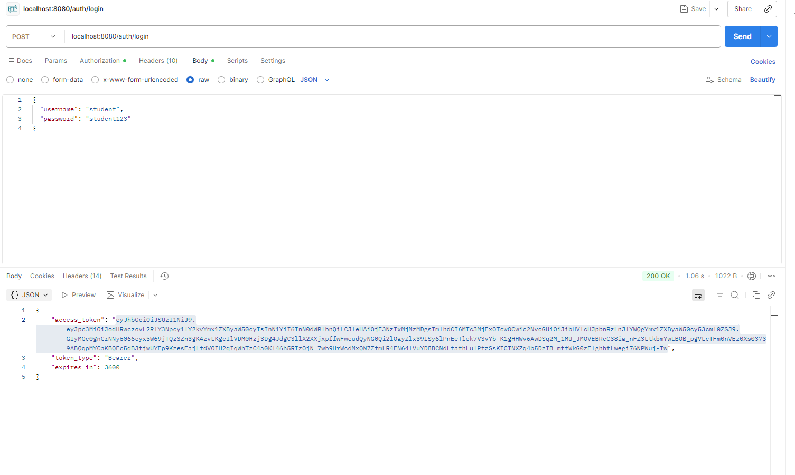

# Lab5-ARSW - BluePrints API con Seguridad JWT y PostgreSQL

Este README documenta las actividades solicitadas del laboratorio con base en la implementación actual del proyecto.

## Requisitos

- JDK 21
- Maven 3.9+
- Docker Desktop

## Ejecución rápida

1. Levantar PostgreSQL en Docker:

```bash
docker run --name blueprints-postgres -e POSTGRES_PASSWORD=blueprints123 -e POSTGRES_DB=blueprintsdb -p 5432:5432 -d postgres:latest
```

2. Ejecutar la API:

```bash
mvn spring-boot:run
```

3. Verificar que la app responde en `http://localhost:8080`.

## Configuración de base de datos usada

En `src/main/resources/application.yml` la aplicación está configurada así:

- URL: `jdbc:postgresql://localhost:5432/blueprintsdb`
- Usuario: `postgres`
- Contraseña: `blueprints123`
- `spring.jpa.hibernate.ddl-auto: update` para crear/actualizar tablas automáticamente con JPA.

## Actividad 1 - ¿Cómo se definen endpoints públicos y protegidos?

La definición está en `src/main/java/co/edu/eci/blueprints/security/SecurityConfig.java`:

- `requestMatchers("/actuator/health", "/auth/login").permitAll()`
	- Deja público el health check y el login.
- `requestMatchers("/v3/api-docs/**", "/swagger-ui/**", "/swagger-ui.html").permitAll()`
	- Permite acceder a la documentación Swagger sin token.
- `requestMatchers("/api/**").hasAnyAuthority("SCOPE_blueprints.read", "SCOPE_blueprints.write")`
	- Protege todo lo que esté bajo `/api/**`; exige token JWT con alguno de esos scopes.
- `anyRequest().authenticated()`
	- Cualquier otro endpoint requiere autenticación.

Adicionalmente, en `src/main/java/co/edu/eci/blueprints/security/MethodSecurityConfig.java` se habilita seguridad a nivel método con `@EnableMethodSecurity`, lo cual permite usar `@PreAuthorize` en controladores.

## Actividad 2 - Flujo de login y análisis de claims del JWT

El flujo de autenticación está en `src/main/java/co/edu/eci/blueprints/auth/AuthController.java`.

### Endpoint de login

`POST /auth/login`

Body:

```json
{
	"username": "student",
	"password": "student123"
}
```

Credenciales válidas definidas en `src/main/java/co/edu/eci/blueprints/security/InMemoryUserService.java`:

- `student / student123`
- `assistant / assistant123`

### Claims que se generan

En `AuthController` se construye `JwtClaimsSet` con:

- `iss` (issuer): tomado de `blueprints.security.issuer` en `application.yml`.
- `iat` (issuedAt): instante actual.
- `exp` (expiresAt): `iat + ttl`.
- `sub` (subject): username autenticado.
- `scope`: `"blueprints.read blueprints.write"`.

Además, el token se firma con algoritmo `RS256` (`JwsHeader.with(() -> "RS256")`).

Respuesta del login:

```json
{
	"access_token": "<jwt>",
	"token_type": "Bearer",
	"expires_in": 3600
}
```


## Actividad 3 - Scopes aplicados a endpoints en carpeta controllers

Los endpoints de negocio principales están en:

- `src/main/java/co/edu/eci/blueprints/controllers/BlueprintsAPIController.java`

Control por scope (vía `@PreAuthorize`):

### Scope `blueprints.read`

- `GET /api/v1/blueprints`
- `GET /api/v1/blueprints/{author}`
- `GET /api/v1/blueprints/{author}/{bpname}`

### Scope `blueprints.write`

- `POST /api/v1/blueprints`
- `PUT /api/v1/blueprints/{author}/{bpname}/points`

También existe un controlador adicional en:

- `src/main/java/co/edu/eci/blueprints/api/BlueprintController.java`

que aplica la misma idea de scopes en rutas `/api/blueprints`:

- `GET /api/blueprints` -> `SCOPE_blueprints.read`
- `POST /api/blueprints` -> `SCOPE_blueprints.write`

### Evidencia de pruebas (con token)

#### 1. Obtener token



#### 2. GET /api/v1/blueprints con token


#### 3. POST /api/v1/blueprints con token


#### 4. GET /api/blueprints con token


#### 5. POST /api/blueprints con token


## Actividad 4 - Pregunta y respuesta

### ¿Qué pasa al modificar el tiempo de expiración del token?

Al cambiar `blueprints.security.token-ttl-seconds` en `application.yml`, cambia el valor que usa `AuthController` para calcular `exp` y `expires_in`.

Por ejemplo:

- Si `token-ttl-seconds: 3600`, el token dura 1 hora.
- Si `token-ttl-seconds: 120`, el token dura 2 minutos.

Efecto práctico:

- Un TTL corto mejora seguridad (menos ventana de uso si se filtra token), pero obliga a renovar token más seguido.
- Un TTL largo mejora comodidad del cliente, pero aumenta riesgo si el token se compromete.

## Pruebas manuales rápidas

1. Obtener token:

```bash
curl -X POST http://localhost:8080/auth/login -H "Content-Type: application/json" -d '{"username":"student","password":"student123"}'
```

2. Consumir endpoint protegido (reemplazar `<TOKEN>`):

```bash
curl -X GET http://localhost:8080/api/v1/blueprints -H "Authorization: Bearer <TOKEN>"
```

3. Crear blueprint:

```bash
curl -X POST http://localhost:8080/api/v1/blueprints -H "Authorization: Bearer <TOKEN>" -H "Content-Type: application/json" -d '{"author":"John","name":"Plano1","points":[{"x":10,"y":20},{"x":30,"y":40}]}'
```

4. Agregar punto:

```bash
curl -X PUT http://localhost:8080/api/v1/blueprints/John/Plano1/points -H "Authorization: Bearer <TOKEN>" -H "Content-Type: application/json" -d '{"x":50,"y":60}'
```

